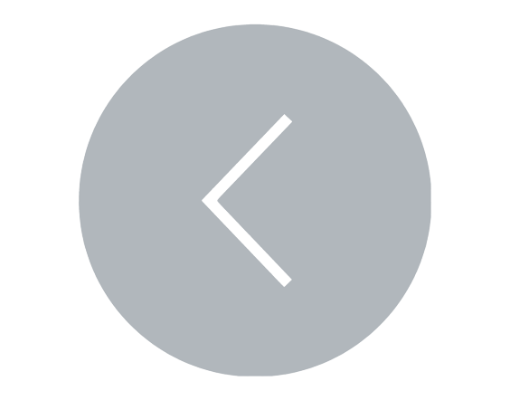

[](../../README.md)

# <div align="center">♛♛♛♛ Análise 3: Oito Damas ♛♛♛♛</div>

[Clique aqui para ir até a atividade das ♛♛♛♛ Oito Damas ♛♛♛♛](../../atividades/3oitodamas/atividade.md)

> Observação: o tipo "BoardType" é exatamente uma lista de listas de inteiro. É sinônimo; um nome para favorecer a legibilidade do código

## ♛ Funções auxiliares

### ♛ empty_board

<details>

   <summary>
      Clique aqui para visualizar a análise da função
   </summary>

   <details>
      <summary>
         Clique aqui para exibir o código da função
      </summary>

```py
def empty_board(n: int) -> BoardType:
   """
	Gera um tabuleiro `BoardType` inicializado e vazio.
	"""
	return deepcopy([[0] * n for _ in range(n)])
```

   </details>

- Criação da lista

<small>Como a função cria "n" listas contendo "n" zeros, então a complexidade dessa parte da função é <i>O(n²)</i></small>

- Cópia profunda

<small>Como a cópia profunda precisa criar "n" cópias de listas contendo "n" elementos, então a complexidade dessa parte da função é <i>O(n²)</i></small>

Conclusão: como ambas as operações são realizadas uma seguida da outra, então a função empty_board tem complexidade de tempo *O(n²)*

Além disso, como a função retorna uma lista de listas, então ela naturalmente tem uma complexidade de espaço *O(n²)*

</details>

**Complexidade de tempo e espaço: *O(n²)***

<hr>

### ♛ print_board

<details>

   <summary>
      Clique aqui para visualizar a análise da função
   </summary>

   <details>
      <summary>
         Clique aqui para exibir o código da função
      </summary>

```py
def print_board(board: BoardType) -> None:
   """
	Dispõe graficamente o tabuleiro `board` em UTF-8.
	"""
   print("\n".join(" ".join("♛" if piece == 1 else "." for piece in row) for row in board))
```

</details>

Como esse print exibe "n" caracteres por linha, e há exatamente "n" linhas, então a complexidade de tempo da função é *O(n²)*

Além disso, como ela não armazena nem retorna nada, então a complexidade de espaço dela é *O(0)*

</details>

**Complexidade de tempo: *O(n²)***

**Complexidade de espaço: *O(0)***

<hr>

### ♛ are_there_n_queens

<details>

   <summary>
      Clique aqui para visualizar a análise da função
   </summary>

   <details>
      <summary>
         Clique aqui para exibir o código da função
      </summary>

```py
def are_there_n_queens(board: BoardType, n: int) -> bool:
	"""
	Retorna `True` se existem `n` rainhas/damas no tabuleiro `board`.
	"""
	return sum(piece == 1 for row in board for piece in row) == n
```

   </details>

A verificação percorre cada "n" elemento de cada "n" linha, portanto, a complexidade de tempo é *O(n)*

Além disso, como a função não armazena nada, e retorna um booleano, então a complexidade de espaço é *O(1)*

</details>

**Complexidade de tempo: *O(n)***

**Complexidade de espaço: *O(1)***

<hr>

### ♛ is_safe

<details>

   <summary>
      Clique aqui para visualizar a análise da função
   </summary>

   <details>
      <summary>
         Clique aqui para exibir o código da função
      </summary>
   
```py
def is_safe(board: BoardType, row: int, column: int) -> bool:
	"""
	Retorna `False` se a posição dada é insegura para uma rainha.
	Retorna `True` caso contrário.
	"""

	size = len(board)
	
	# Verifica se há outra dama na mesma linha.
	for c in range(size):
		if (board[row][c] == 1) and (c != column):
			return False

	# Verifica se há outra dama na mesma coluna.
	for r in range(size):
		if (board[r][column] == 1) and (r != row):
			return False
	
	# Verifica se há outra dama na mesma diagonal principal.
	for i in range(size):
		diagonal_row = row - column + i
		if 0 <= diagonal_row < size:
			if (board[diagonal_row][i] == 1) and ((diagonal_row, i) != (row, column)):
				return False
	
	# Verifica se há outra dama na mesma diagonal secundária.
	for i in range(size):
		diagonal_row = row + column - i
		if 0 <= diagonal_row < size:
			if (board[diagonal_row][i] == 1) and ((diagonal_row, i) != (row, column)):
				return False
	
	# Caso não haja nenhum conflito, retorne `True` (seguro).
	return True
```

</details>

Percebe como a função são basicamente 4 loops?


Como a quantidade de execuções do loop varia linearmente conforme o número de linhas, e como não há nenhum outro comando que eleve a complexidade da função, logo a complexidade de tempo dela é *O(n)*

Além disso, como as variáveis de uma letra dos loops ("c","r",etc.) ocupam, no total, "n" espaços de memória, logo a complexidade de espaço da função é *O(n)*

</details>

**Complexidade de tempo e espaço: *O(n)***

<hr>

Segue abaixo uma tabela compilando a complexidade de tempo e espaço das funções auxiliares:

|        Função        |   Tipo   | Complexidade de Tempo | Complexidade de Espaço |
|:--------------------:|:--------:|:---------------------:|:----------------------:|
|     empty_board      | Auxiliar |        *O(n²)*        |         *O(n²)*        |
|     print_board      | Auxiliar |        *O(n²)*        |          *O(0)*        |
| are_there_n_queens   | Auxiliar |         *O(n)*        |          *O(1)*        |
|       is_safe        | Auxiliar |         *O(n)*        |          *O(n)*        |

## ♛ Função interna: Backtrack

Dentro da função principal (solve_n_queens), existe uma função interna chamada backtracking

<details>

   <summary>
      Clique aqui para visualizar a análise da função
   </summary>

   <details>
      <summary>
         Clique aqui para exibir o código da função
      </summary>

> Observações: 
>- board_copy é uma lista de lista de inteiros
>- found, debug e steps são booleanos
>- checks é um número inteiro

```py
def backtrack(n: int, row: int = 0):

	nonlocal board_copy, found, checks

	# A flag de parada foi definida?
	# Então pare.
	if found:
		return

	# Já existem `n` rainhas?
	if are_there_n_queens(board_copy, n):
			
		# Imprima o tabuleiro.
		print_board(board_copy)
			
		# Defina a flag de "solução encontrada".
		found = True

	# Caso não, itere sobre todas as colunas.
	for column in range(len(board_copy)):

		# Caso uma solução já tenha sido encontrada, pare.
		if found:
			return

		# Adicione uma verificação.
		checks += 1

		# Verifique cada posição (row, column).
		if is_safe(board_copy, row, column):

			# Coloque uma dama na posição [row][column].
			board_copy[row][column] = 1

			if debug:
				print(f"-> Tentando a posição [{row}][{column}].")
				if steps:
					print_board(board_copy)
					print()

			# Chame recursivamente a função para colocar as outras damas.
			backtrack(n, row + 1)

			# Não há necessidade de fazer backtracking caso a solução já tenha sido encontrada.
			if found:
				return

			# Backtracking: remove a dama da posição [row][column].
			# NOTE: Caso tenha dado certo, não há necessidade de executar isso.
			board_copy[row][column] = 0

			if debug:
				print(f"<- Nenhuma posição segura, backtracking em [{row}][{column}].")
				if steps:
					print_board(board_copy)
					print()
```
</details>

### Erros fazem parte do processo de aprendizagem!

Inicialmente, alguns desentendimentos quanto à análise de algoritmos recursivos me conduziram a conclusões equivocadas, e a uma equação de recorrência absurda.

A título de exemplo, quando notei que havia somente 1 linha chamando recursivamente a função, então meu primeiro instinto foi declarar o "a" da equação como 1. No entanto, posteriormente percebi que havia "n" chamadas de recorrência.

Além disso, como o argumento da chamada recursiva da função incrementava - backtrack(n, row + 1) -, meu primeiro pensamento foi declarar o custo recursivo da função como T(n+1). Todavia, logo pensei na lógica da árvore de recursividade, a qual divide os problemas em casos menores e menores até n tender a 1, o que não ocorreria com a minha equação atual; pelo contrário, pois n tenderia a infinito, o que é um absurdo!

Por último, como tinha uma operação O(n) dentro de outra O(n) - função is_safe dentro de um "for" iterando sobre as colunas -, então inicialmente achei que o custo não recursivo da função fosse O(n²). Contudo, percebi que a função is_safe estava influenciando mais na quantidade de chamadas recursivas, e que o custo não recursivo deveria recair sobre a função "are_there_n_queens" ao invés disso.

Equação de recorrência equivocada: T(n+1) + O(n²)

Equação de recorrência final: **nT(n-1) + O(n)**

OLHA A DIFERENÇA!!!

> Ps: eu não explique sobre o n-1 da equação de recorrência final. A lógica por trás dele é que, ao fazer uma chamada recursiva, isso significa que a posição da dama na linha atual foi definida, logo, o problema da função diminui em 1

### Resolvendo a equação de recorrência

Para Backtrack(n), a equação de recorrência seria nT(n-1) + O(n)

Expandindo a equação, ela ficaria n((n-1)T(n-2)+O(n-1)) + O(n)

Expandindo ainda mais, ela ficaria n(n-1)(n-2) * T(n-3) + O(n) + O(n-1) + O(n-2)

Ou seja, em termos gerais, a equação ficaria $$n! \cdot k + \sum_{i=1}^{n} O(i)$$

A parte do somatório é O(n²), pois é a soma de uma série aritmética

Considerando que, para um n suficientemente grande, o n! domina n², então a complexidade de tempo do algoritmo é *O(n!)*. 

**Ou seja, horrível!**

### Complexidade de espaço

Ao analisar o código, não percebi nada que ocupe mais memória do que o próprio tabuleiro (nxn). Portanto, a complexidade de espaço do algoritmo é *O(n²)* 
</details>

**Complexidade de tempo: *O(n!)***

**Complexidade de espaço: *O(n²)***

Segue abaixo a tabela atualizada com a função backtrack

|        Função        |   Tipo   | Complexidade de Tempo | Complexidade de Espaço |
|:--------------------:|:--------:|:---------------------:|:----------------------:|
|     empty_board      | Auxiliar |        *O(n²)*        |         *O(n²)*        |
|     print_board      | Auxiliar |        *O(n²)*        |          *O(0)*        |
| are_there_n_queens   | Auxiliar |         *O(n)*        |          *O(1)*        |
|       is_safe        | Auxiliar |         *O(n)*        |          *O(n)*        |
|		 backtrack       | Interna  |        *O(n!)*        |         *O(n²)*        |

<hr>

## ♛ Função principal: solve_n_queens

<details>

   <summary>
      Clique aqui para visualizar a análise da função
   </summary>

   <details>
      <summary>
         Clique aqui para exibir o código da função
      </summary>

```py
# Cópia do tabuleiro fornecido.
def solve_n_queens(board: BoardType, debug: bool = False, steps: bool = False) -> None:
	"""
	Dispõe uma solução para o problema.
	"""

	# Cópia do tabuleiro fornecido.
	board_copy: BoardType = deepcopy(board)

	# N-rainhas.
	n = len(board_copy)

	# Flag de parada.
	found: bool = False

	# Iterações.
	checks: int = 0

	# Comece realizando o backtracking na primeira linha.
	backtrack(n, 0)

	if not found:
		print("Nenhuma solução encontrada.")
	else:
		print(f"{checks} posições foram verificadas.")
```

</details>

A única linha de código com complexidade de tempo diferente de 1 é a linha que chama a função backtrack. Portanto, a complexidade de tempo será a mesma da função backtrack, ou seja, *O(n!)*

Além disso, como, novamente, não há nada que ocupe mais memória que o próprio tabuleiro, então a complexidade de espaço é *O(n²)*

</details>

**Complexidade de tempo: *O(n!)***

**Complexidade de espaço: *O(n²)***

Segue abaixo a tabela contendo TODAS as funções

|        Função        |   Tipo   | Complexidade de Tempo | Complexidade de Espaço |
|:--------------------:|:--------:|:---------------------:|:----------------------:|
|     empty_board      | Auxiliar |        *O(n²)*        |         *O(n²)*        |
|     print_board      | Auxiliar |        *O(n²)*        |         *O(0)*         |
| are_there_n_queens   | Auxiliar |        *O(n)*         |         *O(1)*         |
|       is_safe        | Auxiliar |        *O(n)*         |         *O(n)*         |
|		 backtrack       | Interna  |        *O(n!)*        |         *O(n²)*        |
|		 solve_n_queens  | Principal|        *O(n!)*        |         *O(n²)*        |