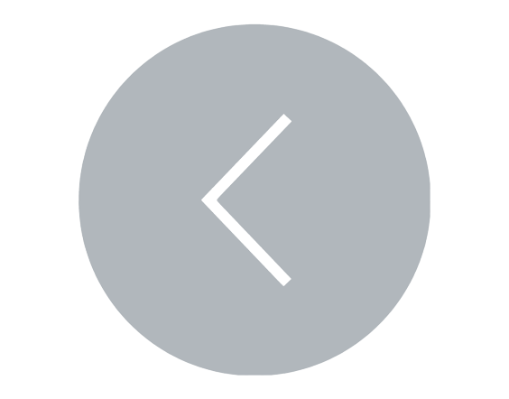

# 
Análise 5: Caixeiro-viajante

## Análise Linha-a-Linha

   

        Clique aqui para ver a análise linha-por-linha
    

| Linha | Código                                                                                                                                                                                                                   | Espaço | Vezes | Custo | Total |
|-------|--------------------------------------------------------------------------------------------------------------------------------------------------------------------------------------------------------------------------|--------|-------|-------|-------|
| 1     | `CaixeiroViajanteForcaBruta(Cidades)`                                                                                                                                                                                    |        |       |       |       |
| 2     | &nbsp;&nbsp;&nbsp;&nbsp;&nbsp;&nbsp;&nbsp;&nbsp;`n <- tamanho de Cidades`                                                                                                                                                |        |       |       |       |
| 3     | &nbsp;&nbsp;&nbsp;&nbsp;&nbsp;&nbsp;&nbsp;&nbsp;`Permutações <- gerar todas as permutações possíveis de cidades`                                                                                                         |        |       |       |       |
| 4     | &nbsp;&nbsp;&nbsp;&nbsp;&nbsp;&nbsp;&nbsp;&nbsp;`MelhorRota <- null`                                                                                                                                                     |        |       |       |       |
| 5     | &nbsp;&nbsp;&nbsp;&nbsp;&nbsp;&nbsp;&nbsp;&nbsp;`MenorDistância <- infinito`                                                                                                                                             |        |       |       |       |
| 6     | &nbsp;&nbsp;&nbsp;&nbsp;&nbsp;&nbsp;&nbsp;&nbsp;`para cada rota em permutações`                                                                                                                                          |        |       |       |       |
| 7     | &nbsp;&nbsp;&nbsp;&nbsp;&nbsp;&nbsp;&nbsp;&nbsp;&nbsp;&nbsp;&nbsp;&nbsp;&nbsp;&nbsp;&nbsp;&nbsp;`DistânciaAtual <- 0`                                                                                                    |        |       |       |       |
| 8     | &nbsp;&nbsp;&nbsp;&nbsp;&nbsp;&nbsp;&nbsp;&nbsp;&nbsp;&nbsp;&nbsp;&nbsp;&nbsp;&nbsp;&nbsp;&nbsp;`para i <- 1 até n - 1`                                                                                                  |        |       |       |       |
| 9     | &nbsp;&nbsp;&nbsp;&nbsp;&nbsp;&nbsp;&nbsp;&nbsp;&nbsp;&nbsp;&nbsp;&nbsp;&nbsp;&nbsp;&nbsp;&nbsp;&nbsp;&nbsp;&nbsp;&nbsp;&nbsp;&nbsp;&nbsp;&nbsp;`DistânciaAtual <- DistânciaAtual + distância entre Rota[i] e Rota[i+1]` |        |       |       |       |
| 10    | &nbsp;&nbsp;&nbsp;&nbsp;&nbsp;&nbsp;&nbsp;&nbsp;&nbsp;&nbsp;&nbsp;&nbsp;&nbsp;&nbsp;&nbsp;&nbsp;`DistânciaAtual <- DistânciaAtual + distancia entre Rota[n] e Rota[1]`                                                   |        |       |       |       |
| 11    | &nbsp;&nbsp;&nbsp;&nbsp;&nbsp;&nbsp;&nbsp;&nbsp;&nbsp;&nbsp;&nbsp;&nbsp;&nbsp;&nbsp;&nbsp;&nbsp;`se DistânciaAtual < MenorDistância`                                                                                     |        |       |       |       |
| 12    | &nbsp;&nbsp;&nbsp;&nbsp;&nbsp;&nbsp;&nbsp;&nbsp;&nbsp;&nbsp;&nbsp;&nbsp;&nbsp;&nbsp;&nbsp;&nbsp;&nbsp;&nbsp;&nbsp;&nbsp;&nbsp;&nbsp;&nbsp;&nbsp;`MenorDistancia <- DistânciaAtual`                                       |        |       |       |       |
| 13    | &nbsp;&nbsp;&nbsp;&nbsp;&nbsp;&nbsp;&nbsp;&nbsp;&nbsp;&nbsp;&nbsp;&nbsp;&nbsp;&nbsp;&nbsp;&nbsp;&nbsp;&nbsp;&nbsp;&nbsp;&nbsp;&nbsp;&nbsp;&nbsp;`MelhorRota <- Rota`                                                     |        |       |       |       |
| 14    | &nbsp;&nbsp;&nbsp;&nbsp;&nbsp;&nbsp;&nbsp;&nbsp;`retornar MelhorRota, MenorDistância`                                                                                                                                    |        |       |       |       |
|       |                                                                                                                                                                                                                          |        |       |       |       |

/
